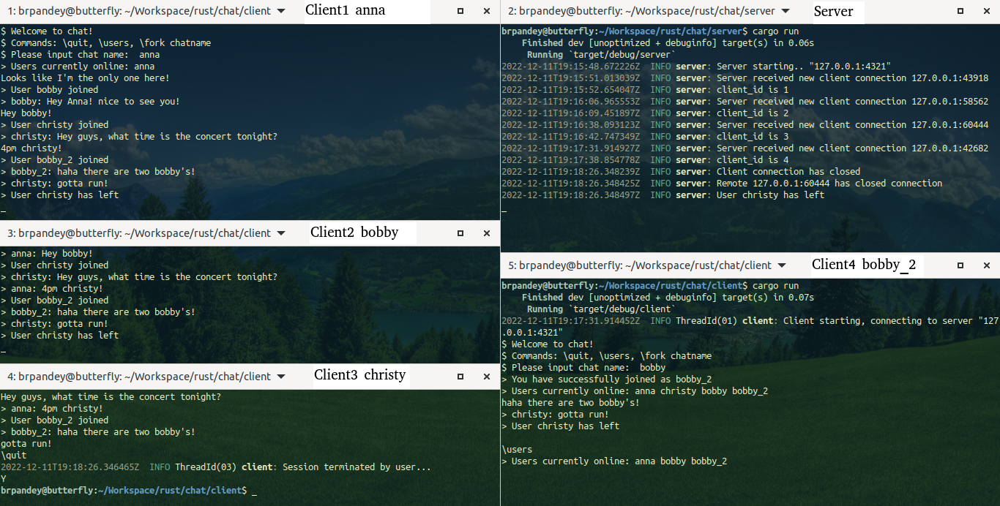

# chat

Open a terminal window for each path: chat/server and chat/client

Run cargo run in each window (run multiple windows for multiple clients)

Multi-line supported with simple peer to peer chat to be supported (no routing/ tunneling)

   

Cheers
Bibek
