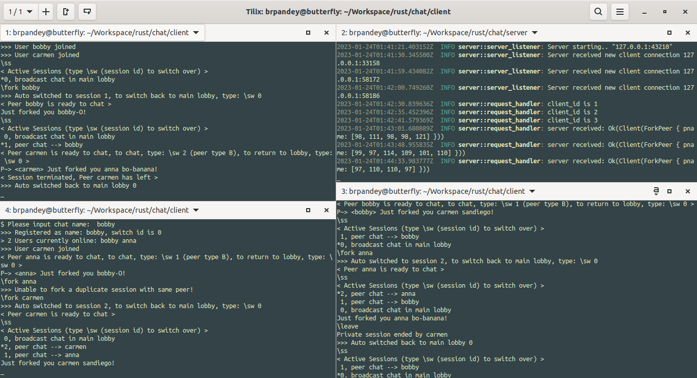

# chat

Open a terminal window for each path: chat/server and chat/client

Run cargo run in each window (run multiple windows for multiple clients)

Multi-line supported with simple peer to peer chat supported (no routing or overlay)

Supports two modes:

* Traditional, clients/server broadcast: broadcast lobby mode, with each client getting a copy of each message
* Private peer sessions: only the two peers A & B in the peer session see the messages

```rust
Usage

$ Commands: \quit, \users, \fork chatname, \switch n, \sessions
Note: fork and users command require that you are in the lobby session e.g. \lobby
$ Please input chat name:

Note
\switch shortcut is \sw
\sessions shortcut is \ss
\fork creates a private, non broadcast session (durable if main server drops)

lobby is available on startup but after a peer session, do \sw 0 or \lob or \lobby
```

<table cellspacing="0" cellpadding="0" border="0">
    <tr>
        <td style="text-align: center;">
            
            <br /><a href="https://github.com/brpandey/chat/blob/main/images/anna.gif">Anna</a>
        </td>
        <td style="text-align: center;">
            
            <br /><a href="https://github.com/brpandey/chat/blob/main/images/server.gif">Server</a>
        </td>
    </tr>
    <tr>
        <td style="text-align: center;">
            
            <br /><a href="https://github.com/brpandey/chat/blob/main/images/bobby.gif">Bobby</a>
        </td>
        <td style="text-align: center;">
            
            <br /><a href="https://github.com/brpandey/chat/blob/main/images/carmen.gif">Carmen</a>
        </td>
    </tr>
</table>

### Chat session - Begin

<p align="center">
  
</p>

* Start with one main (also rendezvous) server and three clients A, B, C -- corresponding to anna, bobby, carmen

* Main server is queried for peer client addr info upon a call to \fork

### Chat session - End

<p align="center">
  
</p>


* When main server drops out, peer sessions are untouched (just can't go back to lobby)

* \ss or \sessions cmd shows which sessions are active, * means active session


### Chat session - Multiple forks

* anna can privately chat with either bobby or carmen, bobby can with either anna or carmen, carmen can with either anna or bobby

<p align="center">
  
</p>


<p float="left">
  
  <br /> <a href="https://github.com/brpandey/chat/blob/main/images/chat3.png">Forks</a>
</p>

Notes:

* P-> means peer session in A mode (e.g. current user initiated it, e.g. sent the \fork)

* P~> means peer session in B mode (e.g. current user received a peer session request from its local peer server)

* When \fork-ing, can't fork again to same peer name with an already active session! Can't also self fork!

* For demo purposes only supports max 4 peer servers on the same node (in production, each peer server would be its own node)

* Handles duplicate names somewhat, as names are used as the unique id

* And uses Tokio! tasks, mpsc, watch channels, Mutexes, RwLocks, atomics, composite structs...


<p align="center">
  
</p>


<!--
 [](https://mermaid.live/edit#pako:eNp9k01v2zAMhv8Ky1MLOEYiJ_0w0BXLBmyXnrJTYWBgbCbxakuGJDfzkvz3yV9D3TjTQYBI-n34ivIBY5UwhrjJ1D7ekbbwYxlJcMuU662mYgefpSSYtcF6rWMy9mecpSztu3DBrPsoTCYTODo9KTk7tinD-o119wHLJJIfOEu1XlcgxkFiFCQug8Rl0BfSOUsIxknBKCm4TArOSIMbgsfHT3CMcGXd7bb5b1qVBTybbQht4LvaQ2qAnVqlJD9dRXiEVZtr92Er_qSRhOvWyk1XtOPKA9cgeV3gV2ks7ElaTsAqMK7HLkNQ6PSNLEPOxtCWfd93gmOzOvckek9LrSipE-G_BoCy7Oo9fk3xK2y0ynsnGVWp3IJlKVPTYBuvZz5nrc-ac12_wRtQu95YKeOMHU7q6qmTOJ9Iu68OET5TKvtjUxHhqSeuajMDL8OhdNMdjGbkZZ7L_E_lo0jTMXqYs84pTdwPeagjEdod5xyh6wkT0q8RRvLk6qi0alXJGEOrS_awLBI3y68puReeY7ihzLhoQfJFqcEZwwP-xlAs5v7d7P7hYT6bT2_FwsMKw8Bf3Ir726lYTOd3wVSIxcnDP43A7PQXdltMKA)
-->

### Architecture 

<p align="center">
  
</p>


--Bibek
